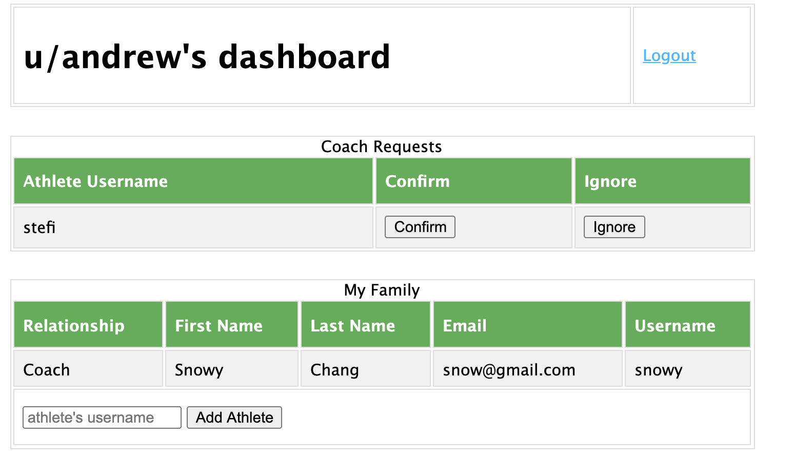
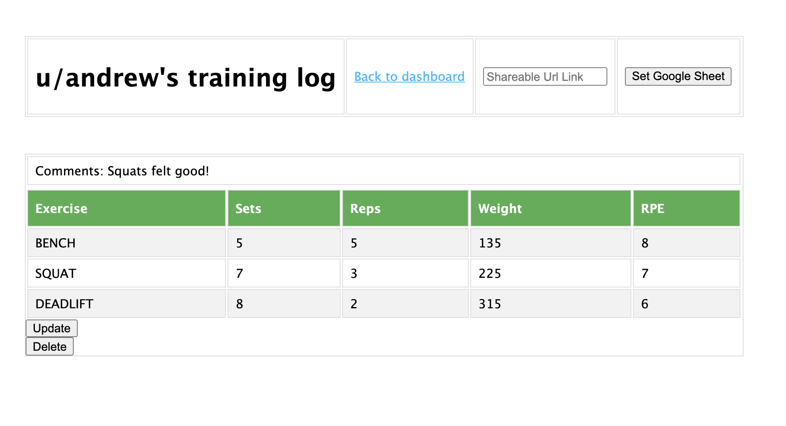

# Athlete Monitoring System

A web application for coaches to monitor their athletes' training,
built using MongoDB, Express.js, and Node.js. Upon registering,
coaches can send a connection request to their athletes. After
athletes confirm their coach, their coach can now view and update
their training logs. Coaches can chooose to either utilize the
built-in training log feature, or they can simply add the link to a
shareable Google Sheet, which will be rendered within the application.

## Demo Images:

Easily manage coach/athlete relationships with access control.


Flexibly log training sessions.


Quickly monitor and update training logs.


## To Run:

Pre-requisite: Node.js must be installed

First, clone this repository.
```
git clone https://github.com/archang19/athleteMonitoringSystem.git
cd athleteMonitoringSystem
```

Then, install all dependencies listed in the package.json file.
```
npm install
```

For macOS or Linux, run the application using this command:
```
DEBUG=athleteMonitoringSystem:* npm start
```

For Windows, use this command instead:
```
SET DEBUG=athleteMonitoringSystem:* & npm start
```

Finally, load http://localhost:3000/ on your browser.